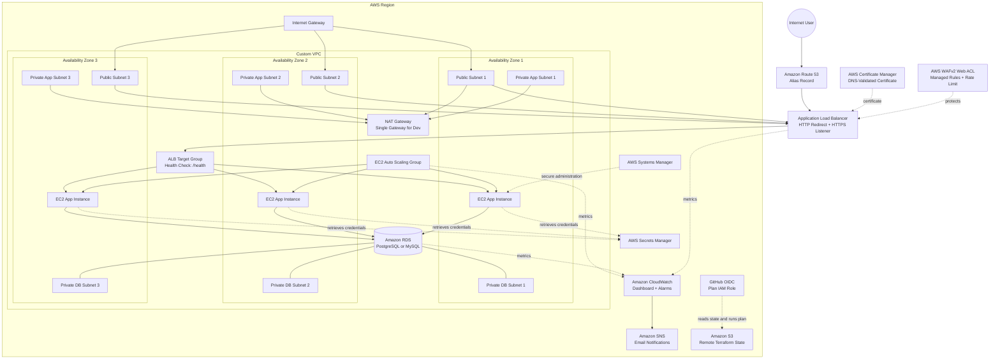
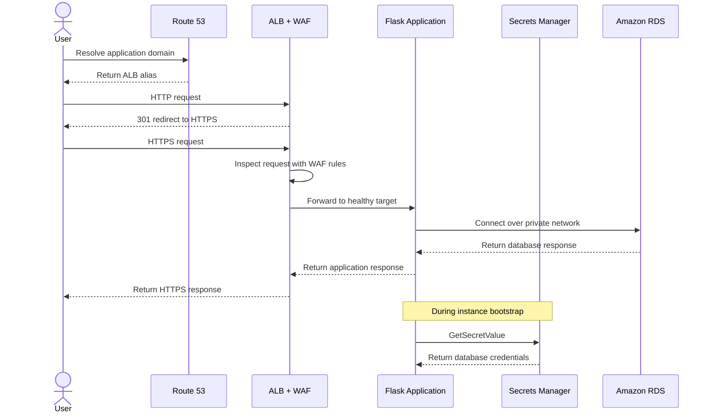
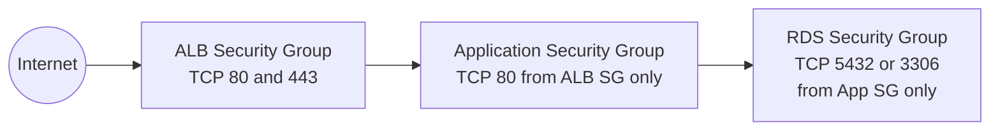

# Highly Available AWS Three-Tier Architecture with Terraform

[](https://github.com/InvestoCloud/AWS_HA3tier_Project/actions/workflows/terraform_plan.yml)


A production-style AWS infrastructure project that uses reusable Terraform modules to deploy a secure, scalable, and observable three-tier web application across multiple Availability Zones.

The project provisions a custom VPC, public load-balancing tier, private EC2 application tier, isolated RDS database tier, HTTPS, DNS, AWS WAF, Secrets Manager, Auto Scaling, CloudWatch monitoring, SNS notifications, remote Terraform state, and GitHub Actions authentication through OpenID Connect.

---

## Project Summary

| Category | Implementation |
|---|---|
| **Cloud Provider** | Amazon Web Services |
| **Infrastructure as Code** | Terraform modules using the HashiCorp AWS provider |
| **Region** | Configurable; defaults to `us-east-1` |
| **Network Design** | Three public, three private application, and three private database subnets |
| **Load Balancing** | Internet-facing Application Load Balancer |
| **Compute** | Amazon Linux 2023 EC2 instances in an Auto Scaling Group |
| **Application** | Python Flask application served by Gunicorn |
| **Database** | Amazon RDS for PostgreSQL or MySQL |
| **DNS** | Route 53 alias record |
| **TLS** | ACM certificate with DNS validation |
| **Web Security** | AWS WAF managed rules and optional IP rate limiting |
| **Secret Management** | AWS Secrets Manager |
| **Instance Access** | AWS Systems Manager Session Manager |
| **Monitoring** | CloudWatch dashboard, metrics, and alarms |
| **Notifications** | Amazon SNS email subscription |
| **Terraform State** | Versioned and encrypted Amazon S3 backend with native lock files |
| **CI Validation** | GitHub Actions running format, validation, and plan checks |
| **CI Authentication** | GitHub OIDC with temporary AWS credentials |

---

## Table of Contents

- [Business Problem](#business-problem)
- [Solution](#solution)
- [Architecture](#architecture)
- [Traffic Flow](#traffic-flow)
- [Availability and Scaling](#availability-and-scaling)
- [Network Design](#network-design)
- [Security Architecture](#security-architecture)
- [Application Bootstrap](#application-bootstrap)
- [Observability](#observability)
- [CI Pipeline](#ci-pipeline)
- [Terraform Modules](#terraform-modules)
- [Repository Structure](#repository-structure)
- [Prerequisites](#prerequisites)
- [Required Configuration](#required-configuration)
- [Deployment](#deployment)
- [Validation and Testing](#validation-and-testing)
- [Cleanup](#cleanup)
- [Cost Considerations](#cost-considerations)
- [Current Design Decisions](#current-design-decisions)
- [Future Improvements](#future-improvements)
- [Skills Demonstrated](#skills-demonstrated)

---

## Business Problem

Manual infrastructure deployment creates several operational risks:

- Environments are difficult to reproduce consistently.
- Configuration changes are not automatically version controlled.
- Console-based deployments are harder to review and audit.
- Security settings can differ between environments.
- Rebuilding infrastructure after a failure takes longer.
- Scaling and monitoring controls are often added inconsistently.

The project addresses these issues by defining the AWS environment as reusable Terraform code that can be reviewed, validated, versioned, and deployed repeatedly.

---

## Solution

This repository deploys a modular three-tier AWS architecture with the following design:

1. Route 53 resolves the application domain to an Application Load Balancer.
2. AWS WAF is associated with the load balancer and inspects incoming requests.
3. Port `80` redirects clients to HTTPS on port `443`.
4. ACM provides the TLS certificate used by the HTTPS listener.
5. The load balancer sends approved traffic to healthy EC2 instances.
6. EC2 instances run in private application subnets inside an Auto Scaling Group.
7. The application retrieves database credentials from Secrets Manager during instance bootstrap.
8. The application connects to RDS through private networking.
9. CloudWatch monitors the ALB, Auto Scaling Group, target group, and RDS instance.
10. SNS sends alarm and recovery notifications to the configured email address.
11. GitHub Actions uses OIDC to assume a plan-only AWS IAM role and run Terraform checks.

---

## Architecture



> The VPC spans three Availability Zones. The RDS `multi_az` setting is configurable, so the database deployment mode depends on the environment values used during deployment.

---

## Traffic Flow



### Network Traffic Rules



---

## Availability and Scaling

### Application Tier

The EC2 application tier uses:

- A Launch Template
- The latest matching Amazon Linux 2023 AMI
- An Auto Scaling Group distributed across private application subnets
- ELB health checks
- A configurable health-check grace period
- Step scaling policies based on average EC2 CPU utilization
- Target group registration through the Auto Scaling Group
- `create_before_destroy` lifecycle behavior for the ASG

Default capacity values:

| Setting | Default |
|---|---:|
| Minimum instances | 2 |
| Desired instances | 2 |
| Maximum instances | 4 |
| Scale-out threshold | 60% CPU |
| Scale-in threshold | 30% CPU |

### Database Tier

The RDS module supports:

- PostgreSQL 16
- MySQL 8.0
- Private DB subnet group
- Encryption at rest
- GP3 storage
- Storage autoscaling
- Automated backups
- Configurable Multi-AZ deployment
- Configurable deletion protection
- Configurable final snapshot behavior

---

## Network Design

The default network uses `10.0.0.0/16` and divides resources by tier.

| Tier | Default CIDR Blocks | Internet Route |
|---|---|---|
| Public | `10.0.1.0/24`, `10.0.2.0/24`, `10.0.3.0/24` | Internet Gateway |
| Private application | `10.0.11.0/24`, `10.0.12.0/24`, `10.0.13.0/24` | NAT Gateway when enabled |
| Private database | `10.0.21.0/24`, `10.0.22.0/24`, `10.0.23.0/24` | No default internet route |

### Routing Strategy

- Public subnets share a public route table with a default route to the Internet Gateway.
- Private application subnets share a route table with an optional default route through the NAT Gateway.
- Private database subnets use a separate route table without a public or NAT default route.
- The ALB is internet-facing.
- EC2 instances and RDS are not assigned public IP addresses.

---

## Security Architecture

Security controls are implemented across identity, network, application, and data layers.

| Security Layer | Implementation |
|---|---|
| **Edge security** | AWS WAF with AWS Managed Common Rule Set and Known Bad Inputs Rule Set |
| **Rate limiting** | Optional IP-based WAF rate rule |
| **Transport encryption** | HTTPS listener using an ACM certificate |
| **HTTP handling** | Port 80 redirects to port 443 |
| **Network segmentation** | Separate public, private app, and private DB subnets |
| **Application ingress** | EC2 accepts port 80 only from the ALB security group |
| **Database ingress** | RDS accepts its database port only from the application security group |
| **Secret storage** | Database credentials stored in Secrets Manager |
| **EC2 secret access** | IAM policy limited to the configured database secret ARN |
| **Instance administration** | SSM Session Manager through `AmazonSSMManagedInstanceCore` |
| **Metadata security** | IMDSv2 required with a hop limit of 1 |
| **Database encryption** | RDS storage encryption enabled |
| **State protection** | S3 versioning, server-side encryption, and public-access blocking |
| **CI authentication** | Temporary credentials through GitHub OIDC |
| **CI permissions** | Separate Terraform plan role with backend and read permissions |

### WAF Rules

The Web ACL contains:

1. `AWSManagedRulesCommonRuleSet`
2. `AWSManagedRulesKnownBadInputsRuleSet`
3. Optional IP-based rate limiting

The Web ACL is regional and associated directly with the Application Load Balancer.

### Secret Retrieval

The EC2 role receives permission to call:

```text
secretsmanager:GetSecretValue
```

The application bootstrap script retrieves the secret and writes the database values to a root-readable environment file with mode `600`.

---

## Application Bootstrap

The Launch Template supplies a user-data script that automatically:

1. Updates Amazon Linux packages.
2. Installs Python, pip, AWS CLI, and `jq`.
3. Installs Flask, Gunicorn, PostgreSQL, and MySQL Python drivers.
4. Retrieves EC2 metadata through IMDSv2.
5. Retrieves database credentials from Secrets Manager.
6. Creates a Flask application in `/opt/cloudops-app`.
7. Creates an environment file containing application configuration.
8. Creates and enables a `systemd` service.
9. Starts Gunicorn on port `80`.

### Application Endpoints

| Endpoint | Purpose | Expected Response |
|---|---|---|
| `/` | Displays instance, Availability Zone, private IP, and database status | HTML application page |
| `/health` | ALB target group health check | `HTTP 200` with `OK` |
| `/db-health` | Verifies database connectivity | `HTTP 200` when connected; otherwise `HTTP 500` |

---

## Observability

### CloudWatch Alarms

| Alarm | Metric | Purpose |
|---|---|---|
| EC2 high CPU | `AWS/EC2 - CPUUtilization` | Detect sustained application-tier CPU pressure |
| ALB 5XX | `AWS/ApplicationELB - HTTPCode_ELB_5XX_Count` | Detect errors generated by the ALB |
| Unhealthy targets | `AWS/ApplicationELB - UnHealthyHostCount` | Detect failed application targets |
| RDS high CPU | `AWS/RDS - CPUUtilization` | Detect database compute pressure |
| RDS low storage | `AWS/RDS - FreeStorageSpace` | Detect storage exhaustion risk |
| ASG scale out | `AWS/EC2 - CPUUtilization` | Add application capacity |
| ASG scale in | `AWS/EC2 - CPUUtilization` | Remove excess application capacity |

Alarm and recovery notifications are sent to the SNS topic.

> The SNS email recipient must confirm the AWS subscription email before notifications are delivered.

### CloudWatch Dashboard

The dashboard includes:

- ALB request count
- ALB target response time
- ALB 5XX errors
- Healthy and unhealthy target counts
- Application-tier CPU utilization
- RDS CPU utilization
- RDS free storage
- Current alarm status

---

## CI Pipeline

The workflow is located at:

```text
.github/workflows/terraform_plan.yml
```

It runs on:

- Pull requests targeting `main`
- Pushes to `main`
- Manual `workflow_dispatch`
- Changes under `environments/`, `modules/`, `backend-bootstrap/`, `github_oidc_bootstrap/`, or the workflow itself

```mermaid
flowchart LR
    Dev["Developer"]
    PR["Pull Request or Push"]
    Checkout["Checkout Repository"]
    OIDC["Assume AWS Role<br/>with GitHub OIDC"]
    Init["terraform init"]
    Fmt["terraform fmt -check"]
    Validate["terraform validate"]
    Vars["Check Required Variables"]
    Plan["terraform plan"]
    Review["Review Proposed Changes"]

    Dev --> PR
    PR --> Checkout
    Checkout --> OIDC
    OIDC --> Init
    Init --> Fmt
    Fmt --> Validate
    Validate --> Vars
    Vars --> Plan
    Plan --> Review
```



### Workflow Permissions

```yaml
permissions:
  id-token: write
  contents: read
  pull-requests: read
```

The workflow uses temporary AWS credentials rather than permanent IAM access keys.

### Required GitHub Configuration

Configure the following repository values before running the workflow.

#### GitHub Actions Secret

| Name | Purpose |
|---|---|
| `AWS_GITHUB_ACTIONS_ROLE_ARN` | ARN of the IAM role assumed through OIDC |
| `DB_PASSWORD` | Database password supplied to Terraform |

#### GitHub Actions Variables

| Name | Purpose |
|---|---|
| `DB_NAME` | Initial database name |
| `DB_USERNAME` | Database master username |
| `DB_SECRET_NAME` | Secrets Manager secret name |
| `DOMAIN_NAME` | Application FQDN |
| `HOSTED_ZONE_NAME` | Existing Route 53 public hosted zone |
| `NOTIFICATION_EMAIL` | SNS notification email |

> Store `DB_PASSWORD` as an encrypted GitHub Actions secret, not as a repository variable.

---

## Terraform Modules

| Module | Responsibility |
|---|---|
| `modules/vpc` | VPC, subnets, Internet Gateway, NAT Gateway, route tables, and associations |
| `modules/security_groups` | ALB, application, and RDS security groups |
| `modules/acm` | ACM certificate, Route 53 validation record, and certificate validation |
| `modules/alb` | ALB, target group, HTTP redirect listener, and HTTPS listener |
| `modules/waf` | WAFv2 Web ACL, managed rules, rate rule, and ALB association |
| `modules/compute` | AMI lookup, IAM role, instance profile, Launch Template, ASG, scaling policies, and application bootstrap |
| `modules/rds` | DB subnet group and encrypted PostgreSQL or MySQL RDS instance |
| `modules/monitoring` | SNS topic, email subscription, CloudWatch alarms, and dashboard |

### Bootstrap Components

| Directory | Responsibility |
|---|---|
| `backend-bootstrap` | Creates the versioned, encrypted, private S3 state bucket |
| `github_oidc_bootstrap` | Creates the GitHub OIDC provider, Terraform plan role, and supporting IAM policies |
| `environments/dev` | Composes all reusable modules into the development environment |

---

## Repository Structure

```text
AWS_HA3tier_Project/
├── .github/
│   └── workflows/
│       └── terraform_plan.yml
├── backend-bootstrap/
│   ├── main.tf
│   ├── outputs.tf
│   └── variables.tf
├── environments/
│   └── dev/
│       ├── backend.tf
│       ├── backend.tf.example
│       ├── dns.tf
│       ├── main.tf
│       ├── outputs.tf
│       ├── providers.tf
│       ├── secrets.tf
│       ├── terraform.tfvars.example
│       ├── variables.tf
│       └── versions.tf
├── github_oidc_bootstrap/
│   ├── main.tf
│   ├── outputs.tf
│   └── variables.tf
├── modules/
│   ├── acm/
│   │   ├── main.tf
│   │   ├── outputs.tf
│   │   └── variables.tf
│   ├── alb/
│   │   ├── main.tf
│   │   ├── outputs.tf
│   │   └── variables.tf
│   ├── compute/
│   │   ├── main.tf
│   │   ├── outputs.tf
│   │   ├── user-data.sh
│   │   └── variables.tf
│   ├── monitoring/
│   │   ├── main.tf
│   │   ├── outputs.tf
│   │   └── variables.tf
│   ├── rds/
│   │   ├── main.tf
│   │   ├── outputs.tf
│   │   └── variables.tf
│   ├── security_groups/
│   │   ├── main.tf
│   │   ├── outputs.tf
│   │   └── variables.tf
│   ├── vpc/
│   │   ├── main.tf
│   │   ├── outputs.tf
│   │   └── variables.tf
│   └── waf/
│       ├── main.tf
│       ├── outputs.tf
│       └── variables.tf
├── .gitignore
└── README.md
```

---

## Prerequisites

You need:

- An AWS account
- Terraform `1.6.0` or newer
- AWS CLI
- Git
- A registered domain
- An existing Route 53 public hosted zone for that domain
- Permission to create IAM, VPC, EC2, ALB, RDS, Route 53, ACM, WAF, CloudWatch, SNS, Secrets Manager, and S3 resources

Confirm the local tools:

```bash
terraform version
aws --version
git --version
```

Configure local AWS authentication:

```bash
aws configure
```

Confirm your identity:

```bash
aws sts get-caller-identity
```

---

## Required Configuration

### Create the Environment Values File

```bash
cd environments/dev
cp terraform.tfvars.example terraform.tfvars
```

Update the values for your environment.

Minimum required values:

```hcl
db_name          = "appdb"
db_username      = "dbadmin"
db_password      = "REPLACE_WITH_A_STRONG_PASSWORD"
db_secret_name   = "ha3tier/dev/database"
notification_email = "you@example.com"

hosted_zone_name = "example.com"
domain_name      = "app.example.com"
```

Do not commit `terraform.tfvars`.

### Important Environment Options

| Variable | Default | Description |
|---|---:|---|
| `aws_region` | `us-east-1` | AWS deployment region |
| `vpc_cidr` | `10.0.0.0/16` | VPC address range |
| `enable_nat_gateway` | `true` | Enables application-tier outbound internet access |
| `instance_type` | `t3.micro` | EC2 application instance type |
| `asg_min_size` | `2` | Minimum ASG capacity |
| `asg_desired_capacity` | `2` | Desired ASG capacity |
| `asg_max_size` | `4` | Maximum ASG capacity |
| `db_engine` | `postgres` | Valid values are `postgres` or `mysql` |
| `db_instance_class` | `db.t3.micro` | RDS instance class |
| `db_allocated_storage` | `20` | Initial storage in GB |
| `db_multi_az` | `true` | Enables or disables RDS Multi-AZ |
| `enable_waf_rate_limit` | `true` | Enables WAF IP rate limiting |
| `waf_rate_limit` | `2000` | Requests per IP in a five-minute evaluation window |

---

## Deployment

### 1. Clone the Repository

```bash
git clone https://github.com/InvestoCloud/AWS_HA3tier_Project.git
cd AWS_HA3tier_Project
```

### 2. Bootstrap the Remote State Bucket

S3 bucket names are globally unique. Choose a unique bucket name before applying.

```bash
cd backend-bootstrap
terraform init
terraform plan \
  -var="state_bucket_name=YOUR-UNIQUE-TERRAFORM-STATE-BUCKET"
terraform apply \
  -var="state_bucket_name=YOUR-UNIQUE-TERRAFORM-STATE-BUCKET"
```

Record the output:

```bash
terraform output
```

### 3. Configure the Environment Backend

Update `environments/dev/backend.tf` with the bucket created in the previous step.

Example:

```hcl
terraform {
  backend "s3" {
    bucket       = "YOUR-UNIQUE-TERRAFORM-STATE-BUCKET"
    key          = "ha3tier/dev/terraform.tfstate"
    region       = "us-east-1"
    encrypt      = true
    use_lockfile = true
  }
}
```

### 4. Bootstrap GitHub OIDC

```bash
cd ../../github_oidc_bootstrap
terraform init
terraform plan \
  -var="github_repo=InvestoCloud/AWS_HA3tier_Project" \
  -var="terraform_state_bucket=YOUR-UNIQUE-TERRAFORM-STATE-BUCKET"
terraform apply \
  -var="github_repo=InvestoCloud/AWS_HA3tier_Project" \
  -var="terraform_state_bucket=YOUR-UNIQUE-TERRAFORM-STATE-BUCKET"
```

Add the resulting role ARN to the GitHub Actions secret:

```text
AWS_GITHUB_ACTIONS_ROLE_ARN
```

### 5. Initialize the Development Environment

```bash
cd ../environments/dev
cp terraform.tfvars.example terraform.tfvars
terraform init -reconfigure
```

### 6. Format and Validate

```bash
terraform fmt -recursive ../..
terraform validate
```

### 7. Review the Deployment Plan

```bash
terraform plan -out=ha3tier.tfplan
```

### 8. Apply the Infrastructure

```bash
terraform apply ha3tier.tfplan
```

### 9. Confirm the SNS Subscription

Open the AWS SNS subscription email and choose **Confirm subscription**.

### 10. Retrieve the Application URL

```bash
terraform output -raw app_url
```

---

## Validation and Testing

### Terraform Validation

```bash
terraform fmt -check -recursive ../..
terraform validate
terraform plan
```

### Application Test

```bash
APP_URL=$(terraform output -raw app_url)
curl -I "$APP_URL"
curl "$APP_URL/health"
curl "$APP_URL/db-health"
```

Expected health check:

```text
OK
```

Expected database check when connectivity is working:

```text
Database Connected
```

### AWS Resource Checks

```bash
aws elbv2 describe-load-balancers
aws elbv2 describe-target-health \
  --target-group-arn "$(terraform output -raw target_group_arn 2>/dev/null || true)"
aws autoscaling describe-auto-scaling-groups
aws rds describe-db-instances
aws cloudwatch describe-alarms
aws wafv2 list-web-acls --scope REGIONAL --region us-east-1
```

### Security Validation

Confirm that:

- EC2 instances do not have public IPv4 addresses.
- RDS has `PubliclyAccessible` set to `false`.
- The application security group does not accept HTTP from `0.0.0.0/0`.
- The RDS security group accepts database traffic only from the application security group.
- HTTP redirects to HTTPS.
- The ACM certificate is issued.
- The WAF Web ACL is associated with the ALB.
- IMDSv2 is required on the Launch Template.
- The Terraform state bucket blocks public access.

---

## Cleanup

Destroy the application environment first:

```bash
cd environments/dev
terraform destroy
```

Then remove the supporting resources only after the environment state is no longer needed.

```bash
cd ../../github_oidc_bootstrap
terraform destroy \
  -var="github_repo=InvestoCloud/AWS_HA3tier_Project" \
  -var="terraform_state_bucket=YOUR-UNIQUE-TERRAFORM-STATE-BUCKET"
```

The S3 state bucket may need to be emptied before it can be destroyed because versioning is enabled.

```bash
cd ../backend-bootstrap
terraform destroy \
  -var="state_bucket_name=YOUR-UNIQUE-TERRAFORM-STATE-BUCKET"
```

---

## Cost Considerations

This architecture can generate charges even when application traffic is low.

Primary cost drivers include:

- NAT Gateway hourly and data-processing charges
- Application Load Balancer usage
- EC2 instances
- RDS instance, storage, and Multi-AZ deployment
- Route 53 hosted zone and DNS queries
- AWS WAF Web ACL and rule evaluations
- CloudWatch metrics, alarms, and logs
- S3 state storage
- Public IPv4 addresses

Destroy lab resources when they are not being used.

---

## Current Design Decisions

| Decision | Current Implementation | Production Consideration |
|---|---|---|
| NAT availability | One NAT Gateway | Use one NAT Gateway per Availability Zone for zone-level resilience |
| App deployment | EC2 user data installs packages at boot | Use a prebuilt AMI or immutable image pipeline |
| Database password | Supplied as a Terraform input and stored in Secrets Manager | Consider RDS-managed master credentials or a secret created outside Terraform |
| RDS protection | Configurable and development-friendly defaults | Enable deletion protection and final snapshots in production |
| RDS availability | Configurable Multi-AZ | Require Multi-AZ for production workloads |
| Terraform apply | Performed manually | Add a protected apply workflow with approvals |
| OIDC plan role | AWS managed read-only policy plus supporting access | Replace broad permissions with service-specific least-privilege policies |
| State encryption | S3-managed AES-256 encryption | Consider a customer-managed KMS key for stricter control |
| Environment layout | Development environment | Add separate staging and production roots |
| Log collection | Metrics and alarms | Add centralized application, ALB, WAF, and database logging |

---

## Future Improvements

- Add separate staging and production environments
- Add an approval-protected Terraform apply workflow
- Add Checkov, TFLint, and Trivy scanning
- Add AWS Config and Security Hub
- Add GuardDuty threat detection
- Enable ALB access logging
- Enable WAF logging
- Add VPC Flow Logs
- Add RDS enhanced monitoring and Performance Insights
- Add automated RDS secret rotation
- Use one NAT Gateway per Availability Zone
- Build immutable AMIs with Packer
- Add blue/green or rolling application deployment
- Add automated integration and load testing
- Add Route 53 health checks and disaster recovery
- Add budget alarms and cost-allocation reporting
- Add policy-as-code controls with OPA or Sentinel

---

## Skills Demonstrated

This project demonstrates practical experience with:

- AWS network architecture
- Multi-tier subnet design
- Infrastructure as Code
- Reusable Terraform modules
- Terraform remote state and locking
- EC2 Launch Templates and Auto Scaling
- Application Load Balancers and health checks
- RDS networking and encryption
- AWS Secrets Manager
- IAM roles and least-privilege design
- GitHub Actions OIDC federation
- TLS certificates and DNS validation
- Route 53 alias records
- AWS WAF managed rules
- CloudWatch dashboards and alarms
- SNS operational notifications
- Linux bootstrap automation
- Flask and Gunicorn deployment
- Operational validation and cleanup

---

## Repository

Created and maintained by [InvestoCloud](https://github.com/InvestoCloud).

This project is intended for cloud engineering, DevOps, security, and Infrastructure-as-Code portfolio demonstration.